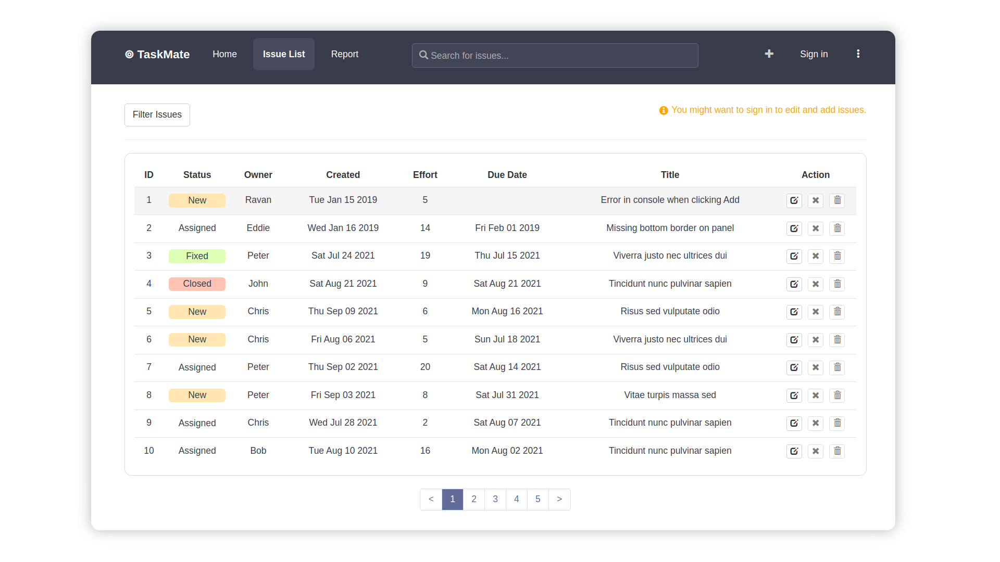

# TaskMate 📝

A project planning app built to test out the capabilities of graphQL and mongoDB.
<br/>



## Features

The users will be able to:<br/>

- **Create** a new task with initial values comprising title, owner, due date and description.<br/>
- **Update** and modify the field values of each task. <br/>
- **Delete** issues which are deemed finished or fixed.
- **Filter** the view of the list of tasks by different parameters.
- **Summarize** the overall status of the tasks with respect to each owner.
  <br/>

**Authentication** is enabled, and only the **authorized** users can perform any addition or modification operations on the tasks. Unauthorized users can still view the data.

## Preview

```bash
sudo docker-compose up
```

Docker compose ref: https://docs.docker.com/compose/

## Local Deveopment

- [tracker-api](./tracker-api/README.md)
- [tracker-ui](./tracker-ui/README.md)

## Attribution

This work was developed while learning MERN stack with the help of the book: [**Pro MERN Stack: Full Stack Web App Development by Vasan Subramanian**](https://g.co/kgs/LcjBT7).
