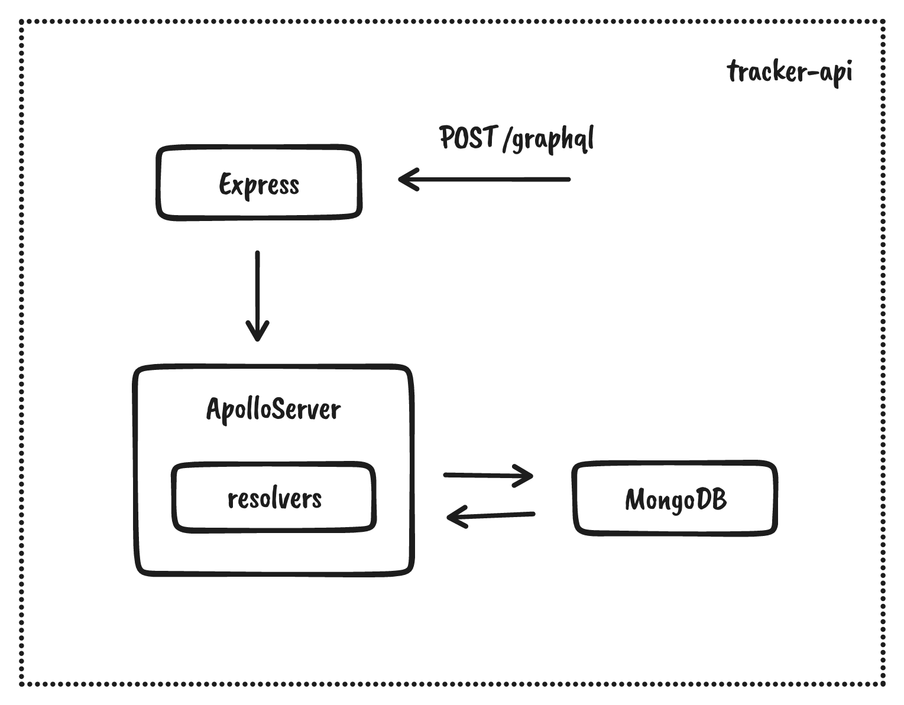

# Issue tracker API

A graphQL service using mongoDB and Apollo server inside ExpressJS.

### A Brief Overview



### How do I get set up?

Start the mongodb local server:

```bash
# initialize the primary daemon process for the MongoDB server
sudo systemctl start mongod
```

Initialize the API server:

```bash
# get into the api folder
cd tracker-api

# prefill data in the local MongoDB server through mongo shell
mongo mongodb://localhost/issuetracker /scripts/init.mongo.js

# install dependencies
npm install

# add environment variables in .env file
echo "DB_URL=mongodb://localhost/issuetracker
API_SERVER_PORT=3000
UI_SERVER_ORIGIN=http://localhost:8000
COOKIE_DOMAIN=localhost
ENABLE_CORS=true
NODE_ENV=development
JWT_SECRET=#any-key-of-your-choice" >> .env

# start the api server
npm start
```
