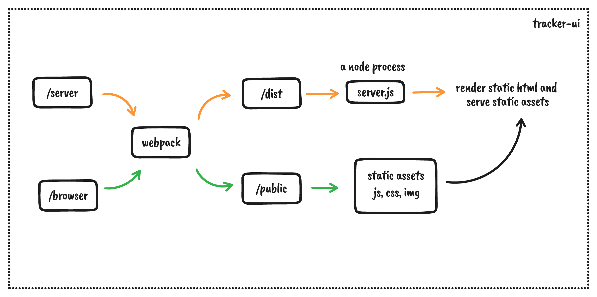

# Issue tracker UI

A React app which utilizes the graphQL service from `tracker-api`. It serves static html on first page load followed by hydration.

### A Brief Overview



### How do I get set up?

```bash
# get into the ui folder
cd tracker-ui

# add environment variable in .env file
echo "UI_SERVER_PORT=8000
UI_API_ENDPOINT=http://localhost:3000/graphql
UI_AUTH_ENDPOINT=http://localhost:3000/auth
NODE_ENV=development
ENABLE_HMR=false" >> .env

# install dependencies
npm install

# start the development server
npm run dev
```
